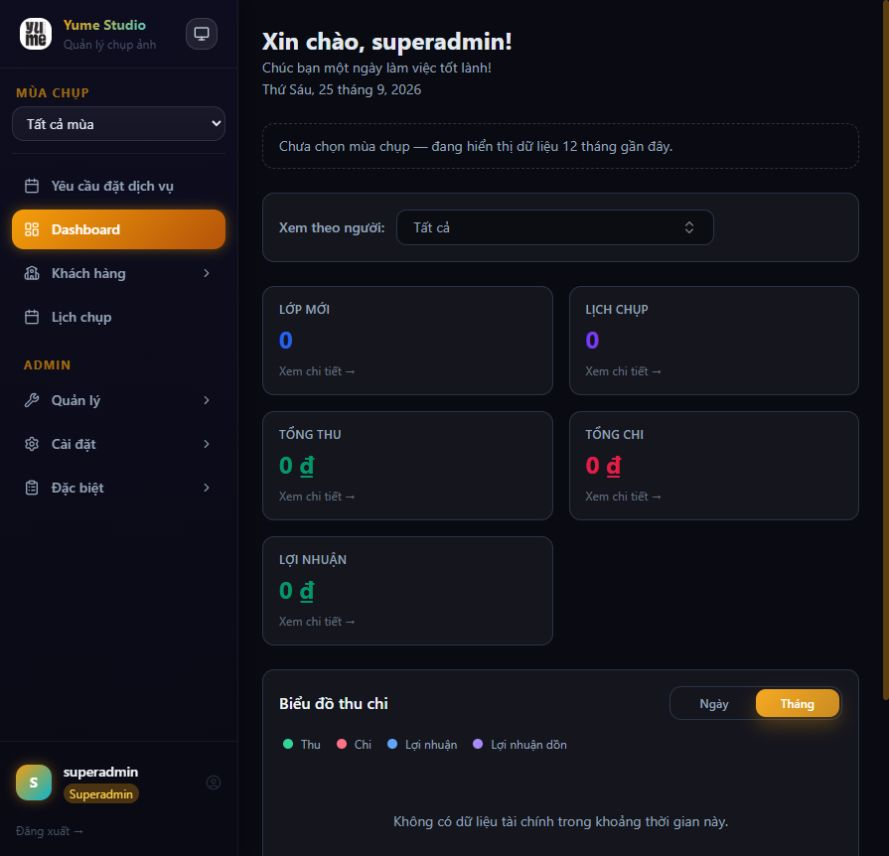
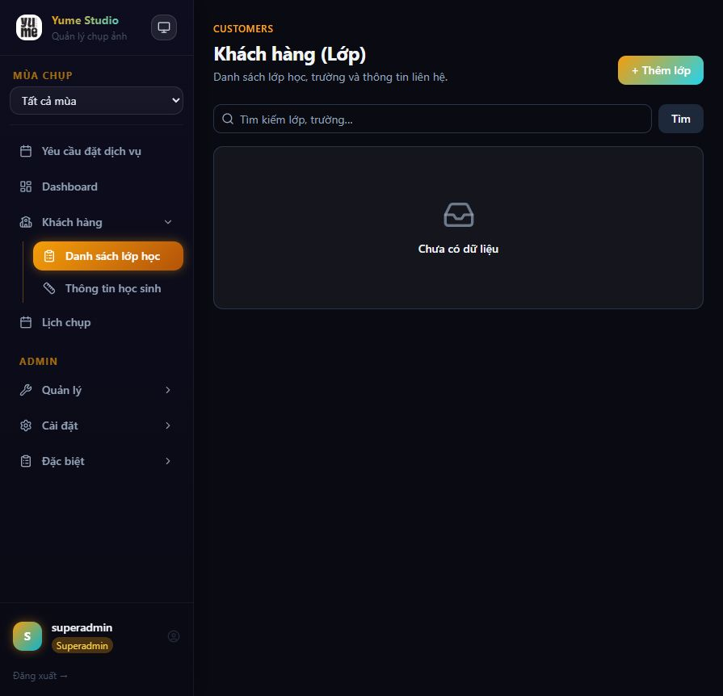
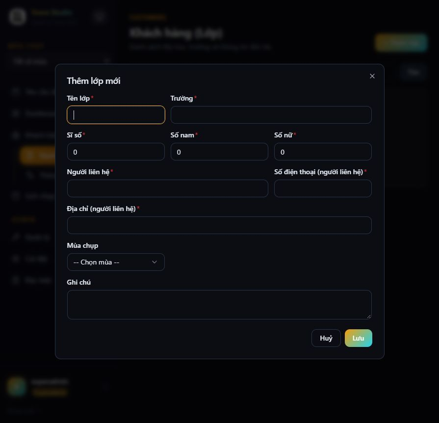
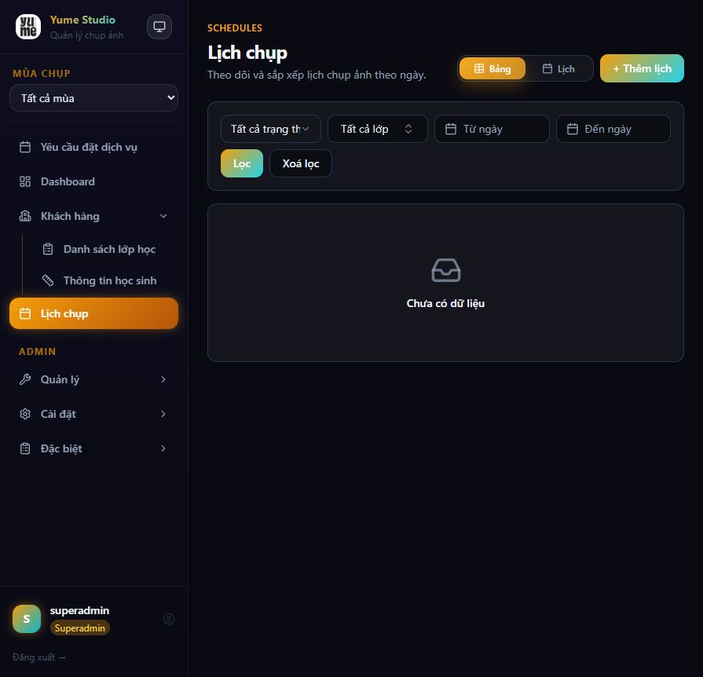
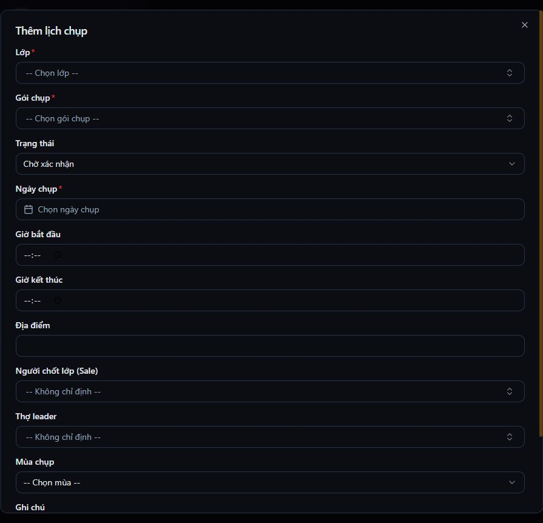
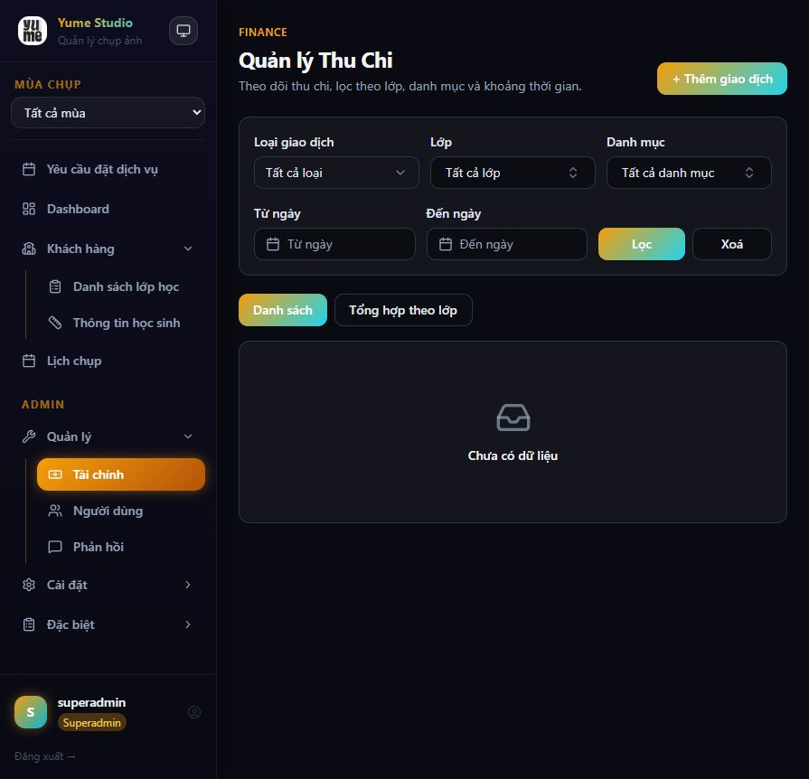
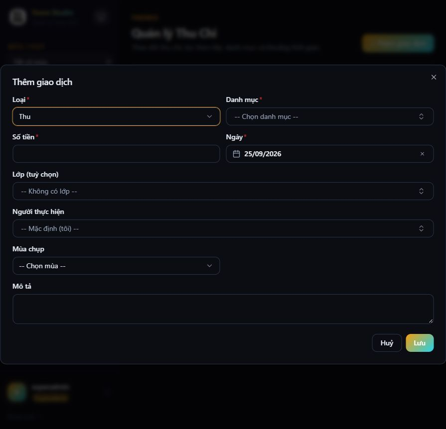
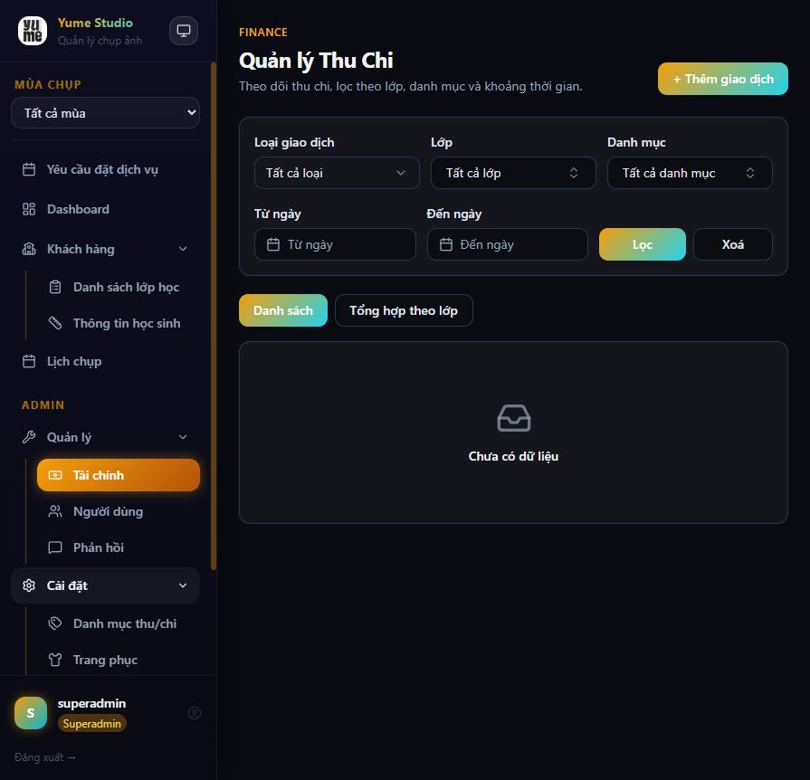
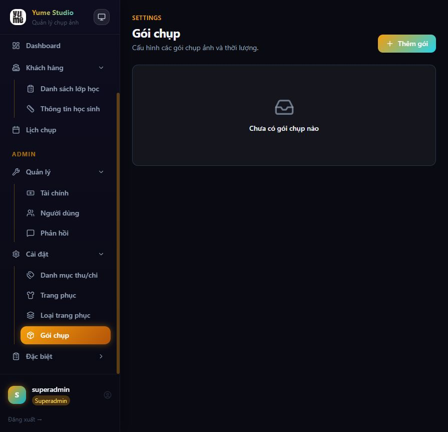
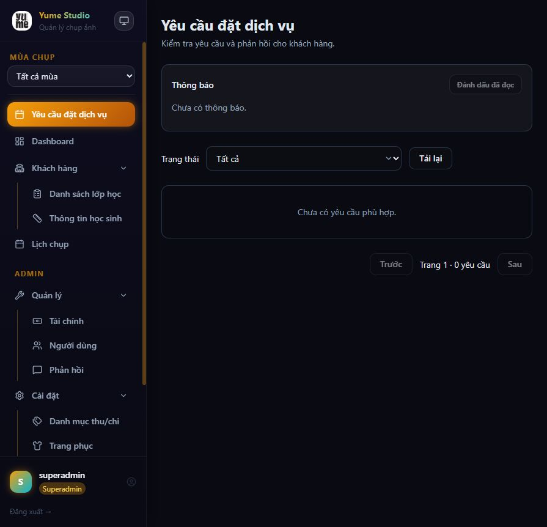

# Kế hoạch cải tiến nghiệp vụ và điều hướng — Yume Studio

Ngày audit: 25/09/2026  
Phạm vi: back-office quản trị trên desktop, tập trung vào Dashboard, lớp học, lịch chụp, tài chính, gói chụp và yêu cầu đặt dịch vụ.

## 1. Kết luận nhanh

Giao diện hiện tại đã có nền tảng thị giác khá tốt và các phân hệ nghiệp vụ chính đã xuất hiện. Điểm yếu lớn nhất không nằm ở màu sắc hay hiệu ứng, mà ở việc hệ thống vẫn được tổ chức như một tập hợp các trang CRUD độc lập. Người dùng phải tự ghi nhớ mối liên hệ giữa yêu cầu đặt dịch vụ, lớp, lịch chụp, nhân sự, trang phục và giao dịch.

Hướng cải tiến nên chuyển từ **điều hướng theo module** sang **điều hướng theo hành trình công việc**:

`Yêu cầu → Tư vấn/báo giá → Kiểm tra nguồn lực → Chốt lịch → Thực hiện → Hậu kỳ/bàn giao → Đối soát → Đánh giá`

## 2. Bằng chứng từ luồng hiện tại

### Bước 1 — Dashboard — sức khỏe: Trung bình

- Có KPI và lối tắt sang các phân hệ.
- KPI phản ánh dữ liệu, nhưng chưa trả lời “hôm nay cần xử lý việc gì”.
- Chưa có hàng đợi công việc: yêu cầu mới, lịch cần chốt, cọc chưa thu, hậu kỳ trễ, đơn thuê sắp trả.

### Bước 2 — Danh sách lớp học — sức khỏe: Trung bình

- Cấu trúc trang nhất quán, có tìm kiếm và CTA rõ.
- Nhãn “Khách hàng”, “Lớp”, “học sinh” đang được dùng đan xen, dễ khiến mô hình dữ liệu và cách gọi nghiệp vụ không thống nhất.
- Trạng thái rỗng chưa gợi ý bước tiếp theo hoặc cách nhập dữ liệu nhanh.

### Bước 3 — Tạo lớp — sức khỏe: Cần cải thiện

- Form gom quá nhiều thông tin vào một modal.
- Người dùng phải nhập tổng sĩ số, số nam và số nữ riêng; hệ thống nên tự tính hoặc kiểm tra tính nhất quán.
- “Mùa chụp” là ngữ cảnh toàn hệ thống nhưng lại để chọn tùy ý trong từng form, có nguy cơ tạo dữ liệu không thuộc mùa đang làm việc.

### Bước 4 — Lịch chụp — sức khỏe: Trung bình

- Có hai chế độ bảng/lịch và bộ lọc hợp lý.
- Lịch vẫn là một phân hệ độc lập; chưa xuất phát tự nhiên từ yêu cầu đã duyệt hoặc hồ sơ lớp.
- Bộ lọc chưa được biểu diễn trên URL, nên có nguy cơ mất trạng thái khi quay lại từ trang chi tiết.

### Bước 5 — Tạo lịch chụp — sức khỏe: Yếu

- Modal dài hơn viewport; hành động Lưu/Hủy không hiện trong khung nhìn đầu tiên.
- Người dùng phải ghép thủ công lớp, gói, nhân sự, mùa và thời gian.
- Chưa có tín hiệu kiểm tra trùng lịch nhân sự, thiết bị hoặc tồn trang phục trước khi xác nhận.

### Bước 6 — Tài chính — sức khỏe: Trung bình

- Có lọc và tổng hợp theo lớp.
- Nút “Xoá” cạnh “Lọc” dễ bị hiểu là xóa dữ liệu thay vì xóa bộ lọc.
- Giao dịch chưa được đặt trong ngữ cảnh của một hồ sơ dịch vụ, lịch chụp hay đơn thuê cụ thể.

### Bước 7 — Thêm giao dịch — sức khỏe: Trung bình

- Form gọn và có ngày mặc định hợp lý.
- “Lớp”, “Mùa chụp” đều tùy chọn; thiếu liên kết bắt buộc tới dịch vụ/đơn hàng khiến đối soát, công nợ và lợi nhuận dễ lệch.

### Bước 8 — Sidebar mở nhiều nhóm — sức khỏe: Yếu

- Nhiều accordion có thể mở cùng lúc, làm menu dài và phải cuộn.
- Menu giữ lại các nhóm đã mở kể cả khi chuyển sang phân hệ khác, tạo nhiễu và đẩy mục quan trọng ra khỏi khung nhìn.
- “Quản lý”, “Cài đặt”, “Đặc biệt” là nhãn hệ thống, không phản ánh công việc thực tế.

### Bước 9 — Gói chụp trong Cài đặt — sức khỏe: Yếu

- Gói chụp là danh mục bán hàng cốt lõi nhưng lại nằm dưới “Cài đặt”.
- Trang phục và loại trang phục cũng là nghiệp vụ kho/dịch vụ, không phải cài đặt hệ thống.

### Bước 10 — Yêu cầu đặt dịch vụ — sức khỏe: Cần cải thiện

- Đây là điểm vào quan trọng nhưng đang tách rời lịch, lớp và tài chính.
- Thông báo nằm bên trong trang yêu cầu thay vì là inbox chung của toàn hệ thống.
- Trạng thái hiện tại mới dừng ở duyệt/từ chối; chưa dẫn người dùng tới bước tiếp theo như tư vấn, báo giá, kiểm tra nguồn lực và chốt lịch.

## 3. Cấu trúc điều hướng đề xuất

### Thanh điều hướng chính

1. **Tổng quan**
   - Dashboard theo vai trò
   - Việc cần xử lý hôm nay
2. **Công việc**
   - Yêu cầu mới
   - Lịch chụp
   - Phân công & tiến độ
   - Hậu kỳ/bàn giao
3. **Khách hàng**
   - Lớp & người liên hệ
   - Thành viên & số đo
   - Hồ sơ dịch vụ
4. **Dịch vụ & kho**
   - Gói chụp
   - Trang phục/phụ kiện
   - Đơn thuê
   - Tồn khả dụng
5. **Tài chính**
   - Giao dịch
   - Cọc & công nợ
   - Báo cáo
6. **Hệ thống**
   - Mùa chụp
   - Danh mục thu/chi
   - Người dùng & phân quyền

“Phản hồi” nên nằm trong Khách hàng/Chất lượng dịch vụ. “Đặc biệt” nên bỏ hoàn toàn. Sidebar chỉ nên mở một nhóm tại một thời điểm, tự mở nhóm chứa trang hiện tại và có thể ghim 3–5 mục thường dùng.

### Điều hướng trong ngữ cảnh

- Thêm breadcrumb: `Khách hàng / 12A1 / Lịch chụp / Chỉnh sửa`.
- Giữ bộ lọc, trang, chế độ xem và vị trí cuộn trên URL để nút Back hoạt động đúng.
- Thêm tìm kiếm toàn cục theo lớp, số điện thoại, booking và lịch.
- Thêm nút “Tạo mới” toàn cục, mở các lựa chọn theo vai trò: Lớp, Lịch, Giao dịch, Yêu cầu thuê.
- Form ngắn dùng modal; form dài như tạo lịch dùng route hoặc drawer có footer cố định.
- Sau khi lưu, dẫn về trang chi tiết của đối tượng và hiển thị hành động tiếp theo, không chỉ toast rồi quay về danh sách.

## 4. Cải tiến nghiệp vụ cốt lõi

### 4.1. Tạo “Hồ sơ dịch vụ” làm trục chính

Mỗi yêu cầu sau khi tiếp nhận cần trở thành một hồ sơ dịch vụ liên kết:

- tài khoản khách và lớp;
- gói/báo giá đã chốt;
- lịch và nguồn lực;
- trang phục/đơn thuê;
- giao dịch, cọc và công nợ;
- timeline trao đổi, thay đổi trạng thái và người chịu trách nhiệm;
- bàn giao và phản hồi.

Đây là thay đổi quan trọng nhất vì nó biến các trang CRUD rời rạc thành một quy trình có thể theo dõi.

### 4.2. Chuẩn hóa vòng đời dịch vụ

Đề xuất trạng thái:

`Mới → Cần tư vấn → Đã báo giá → Chờ khách xác nhận → Chờ kiểm tra nguồn lực → Đã chốt lịch → Đang thực hiện → Hậu kỳ → Chờ bàn giao → Hoàn tất`

Nhánh ngoại lệ: `Từ chối`, `Khách hủy`, `Studio hủy`, `Cần xử lý phát sinh`.

Mỗi trạng thái phải có:

- điều kiện vào/ra;
- người chịu trách nhiệm;
- hành động tiếp theo;
- thời hạn xử lý;
- lý do khi từ chối/hủy;
- sự kiện tạo thông báo cho khách và nhân viên liên quan.

### 4.3. Kiểm tra nguồn lực trước khi chốt

- Chặn hoặc cảnh báo trùng lịch nhân sự.
- Kiểm tra tồn trang phục theo mẫu, size, số lượng, thời gian và tình trạng.
- Giữ chỗ có thời hạn khi khách đang xác nhận.
- Chỉ chuyển sang “Đã chốt lịch” khi đủ nguồn lực và điều kiện cọc/báo giá đã thỏa mãn.

### 4.4. Gắn tài chính vào đúng dịch vụ

- Mỗi khoản thu/chi phải liên kết tới hồ sơ dịch vụ hoặc đơn thuê, trừ một số chi phí chung có lý do rõ ràng.
- Theo dõi riêng báo giá, cọc phải thu, đã thu, còn nợ, hoàn cọc, phụ phí.
- Tự động tạo nhắc việc khi quá hạn thanh toán hoặc chưa đối soát sau bàn giao.

### 4.5. Dashboard theo hành động

Thay KPI thuần số liệu bằng các khối có thể xử lý ngay:

- 5 yêu cầu mới chưa có người phụ trách;
- 3 lịch chụp tuần này chưa đủ ekip;
- 2 lớp chưa hoàn tất số đo;
- 4 khoản cọc quá hạn;
- 1 buổi chụp đã xong nhưng chưa bàn giao.

## 5. Lộ trình triển khai

### Giai đoạn 1 — Quick wins về điều hướng (1–2 tuần)

- Đổi IA/sidebar theo nhóm công việc.
- Chỉ mở một nhóm menu; tự cuộn tới mục active.
- Thêm breadcrumb, tìm kiếm toàn cục và nút tạo mới.
- Đưa bộ lọc lên URL và giữ trạng thái khi quay lại.
- Đổi “Xoá” thành “Xóa bộ lọc”.
- Chuyển form tạo lịch sang trang/drawer với footer cố định.
- Cải thiện empty state bằng CTA và hướng dẫn bước tiếp theo.

### Giai đoạn 2 — Khép kín yêu cầu đến lịch (2–4 tuần)

- Tạo Hồ sơ dịch vụ và timeline.
- Chuẩn hóa trạng thái, người phụ trách và lý do hủy/từ chối.
- Từ yêu cầu đã duyệt tạo lớp/lịch mà không nhập lại.
- Dashboard “Việc cần xử lý” và inbox thông báo toàn cục.

### Giai đoạn 3 — Nguồn lực, kho và tài chính (3–5 tuần)

- Kiểm tra trùng lịch nhân sự và tồn trang phục.
- Hoàn thiện đơn thuê, giao/nhận trả, gia hạn và phụ phí.
- Liên kết cọc, công nợ và giao dịch vào hồ sơ dịch vụ.
- Báo cáo lợi nhuận theo dịch vụ/lớp/mùa.

### Giai đoạn 4 — Portal khách hàng và tối ưu vận hành (2–3 tuần)

- Khách theo dõi timeline, lịch, thanh toán và bàn giao.
- Cho phép xác nhận báo giá, yêu cầu đổi lịch/gia hạn và bổ sung số đo.
- Bổ sung chỉ số chuyển đổi và thời gian xử lý theo từng bước.

## 6. Chỉ số nghiệm thu

- Số thao tác từ yêu cầu mới đến lịch đã chốt: mục tiêu giảm còn tối đa 5 hành động chính.
- Tỷ lệ yêu cầu có người phụ trách trong ngày.
- Thời gian trung vị từ yêu cầu đến báo giá và từ báo giá đến chốt lịch.
- Số trường hợp trùng nhân sự/trang phục sau khi đã xác nhận: mục tiêu bằng 0.
- Tỷ lệ giao dịch gắn đúng hồ sơ dịch vụ: mục tiêu trên 95%.
- Tỷ lệ dịch vụ hoàn tất có đủ bàn giao, đối soát và phản hồi.
- Số lần người dùng quay lại danh sách nhưng mất bộ lọc/trang: mục tiêu bằng 0.

## 7. Rủi ro accessibility quan sát được

- Một số chữ phụ và placeholder trên nền tối có độ tương phản thấp; cần đo contrast thực tế.
- Form dài trong modal có hành động nằm ngoài viewport; cần kiểm tra thao tác bàn phím, focus trap và vị trí focus khi lỗi.
- Cấu trúc heading chưa đồng nhất giữa các trang.
- Trạng thái mở/đóng của nhóm menu cần được công bố bằng `aria-expanded` và hỗ trợ phím.

Ảnh chụp không đủ để kết luận tuân thủ WCAG. Cần kiểm tra keyboard-only, focus visible, screen reader, zoom 200% và responsive reflow riêng.

## 8. Quyết định cần chốt trước khi phát triển

1. Một tài khoản khách có thể quản lý nhiều lớp/hồ sơ dịch vụ hay không?
2. `Customer` hiện tại và tài khoản client được liên kết bằng quy tắc nào?
3. Điều kiện nào biến một yêu cầu được duyệt thành lịch đã xác nhận?
4. Cọc tối thiểu, thời hạn giữ chỗ và quy tắc hoàn/hủy là gì?
5. Trang phục cho buổi chụp và cho thuê ngoài có dùng chung tồn kho không?
6. Ai chịu trách nhiệm ở từng trạng thái và thời hạn xử lý là bao lâu?

## 9. Trạng thái triển khai

Cập nhật 25/09/2026 — Giai đoạn 1 đã bắt đầu:

- [x] Sidebar chỉ mở một nhóm tại một thời điểm.
- [x] Tự mở nhóm chứa route hiện tại và cuộn mục active vào vùng nhìn.
- [x] Bổ sung `aria-expanded`/`aria-controls` cho nhóm điều hướng.
- [x] Thêm breadcrumb cho các route quản trị hiện có, gồm chi tiết khách hàng.
- [x] Đổi “Xoá” thành “Xóa bộ lọc” tại trang Tài chính.
- [x] Sửa liên kết KPI tài chính trên Dashboard về đúng `/manage/finance`.
- [ ] Tái nhóm toàn bộ sidebar theo “Công việc / Khách hàng / Dịch vụ & kho / Tài chính / Hệ thống”.
- [ ] Đưa trạng thái bộ lọc lên URL và khôi phục khi quay lại.
- [ ] Chuyển form tạo lịch dài sang route hoặc drawer có footer cố định.
- [ ] Thêm tìm kiếm toàn cục và nút “Tạo mới”.
